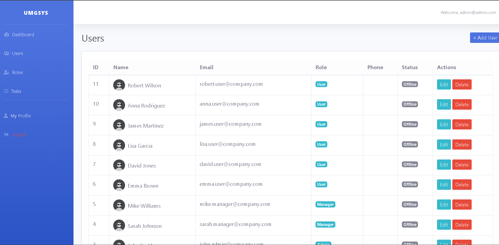
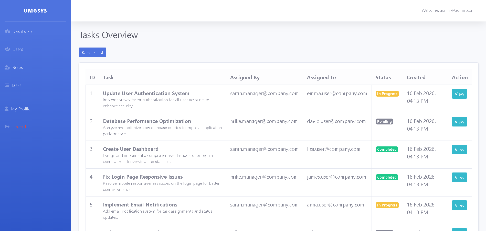
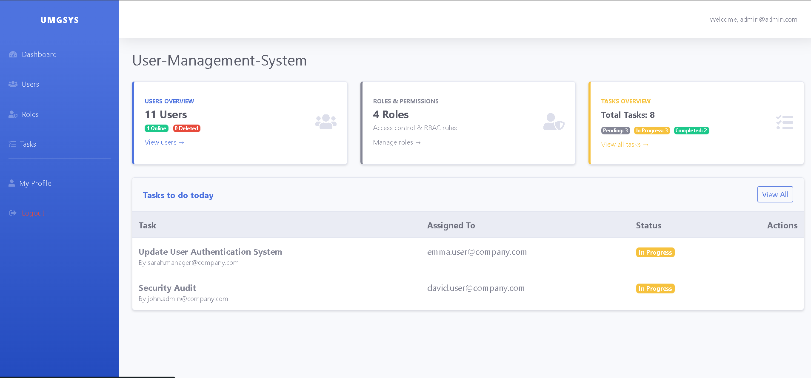

# User Management System (UMGSYS)

A comprehensive **Role-Based Access Control (RBAC)** system built with PHP, featuring user management, task assignment, two-factor authentication, and session tracking.


---

## 📋 Table of Contents

- [Features](#-features)
- [Screenshots](#-screenshots)
- [Tech Stack](#-tech-stack)
- [Installation](#-installation)
- [Usage](#-usage)
- [Demo Credentials](#-demo-credentials)
- [Project Structure](#-project-structure)
- [Security Features](#-security-features)
- [Contributing](#-contributing)
- [License](#-license)

---

## ✨ Features

### 🔐 Authentication & Security
- **Secure Login/Logout** with session management
- **Two-Factor Authentication (2FA)** using TOTP
- **Password Reset** functionality
- **Session Tracking** with device and IP logging
- **Active Session Limits** (max 3 concurrent sessions per user)

### 👥 User Management
- Complete **CRUD operations** for users
- **Role-Based Access Control** (Super Admin, Admin, Manager, User)
- User profile management
- Soft delete functionality
- Online/offline user status tracking

### 📝 Task Management
- Create, assign, and track tasks
- Task status management (Pending, In Progress, Completed)
- Task assignment to specific users
- Start and end date tracking
- Task overview dashboard

### 🎯 Role-Based Permissions
- **Super Admin**: Full system access, role management
- **Admin**: User and task management
- **Manager**: Task assignment and management
- **User**: View assigned tasks, update profile

### 📊 Dashboard & Analytics
- Real-time user statistics
- Task status overview
- Today's task assignments
- Online user tracking

---

## 📸 Screenshots

### Users Management

*Comprehensive user management with role-based filtering and actions*

### Tasks Overview

*Task management dashboard with status tracking and assignment details*

### Dashboard

*Admin dashboard with real-time statistics and quick actions*

---

## 🛠️ Tech Stack

### Backend
- **PHP 8.4** - Modern PHP with OOP principles
- **MySQL** - Relational database with PDO
- **Session Management** - Secure session handling

### Frontend
- **Bootstrap 5** - Responsive UI framework (SB Admin 2 theme)
- **JavaScript/jQuery** - Interactive functionality
- **SweetAlert2** - Beautiful alerts and notifications
- **Font Awesome** - Icon library

### Security
- **Password Hashing** - bcrypt/argon2
- **CSRF Protection** - Session-based validation
- **SQL Injection Prevention** - PDO prepared statements
- **XSS Protection** - Input sanitization
- **Environment Variables** - Secure credential management

---

## 📦 Installation

### Prerequisites
- PHP 8.0 or higher
- MySQL 5.7 or higher
- Apache/Nginx web server
- Composer (optional)

### Step 1: Clone Repository
```bash
git clone https://github.com/yourusername/user-management-system.git
cd user-management-system
```

### Step 2: Configure Environment
```bash
# Copy environment example
cp .env.example .env

# Edit .env with your database credentials
DB_HOST=localhost
DB_NAME=user_management_system
DB_USER=your_username
DB_PASS=your_password
BASE_URL=/user_management-system
```

### Step 3: Create Database
```sql
CREATE DATABASE user_management_system;
```

Import your SQL schema file (if you have one):
```bash
mysql -u your_username -p user_management_system < database.sql
```

### Step 4: Configure Web Server

**For Apache (Laragon/XAMPP/WAMP):**
- Place project in `htdocs` or `www` folder
- Access via `http://localhost/user_management-system/`

**For Nginx:**
```nginx
server {
    listen 80;
    server_name localhost;
    root /path/to/user_management-system;
    index index.php;

    location / {
        try_files $uri $uri/ /index.php?$query_string;
    }

    location ~ \.php$ {
        fastcgi_pass unix:/var/run/php/php8.4-fpm.sock;
        fastcgi_index index.php;
        include fastcgi_params;
    }
}
```

### Step 5: Set Permissions
```bash
chmod -R 755 .
chmod -R 777 admin/uploads/
```

---

## 🚀 Usage

### Access the Application
```
http://localhost/user_management-system/
```

The root URL will automatically redirect you to:
- **Login page** (if not authenticated)
- **Dashboard** (if already logged in)

### First Time Setup
1. Start your web server (Apache/Nginx)
2. Start MySQL server
3. Visit the application URL
4. Login with demo credentials (see below)

---

## 🔑 Demo Credentials

### Super Admin
```
Email: admin@admin.com
Password: admin123
```

### Admin
```
Email: john.admin@company.com
Password: password123
```

### Manager
```
Email: sarah.manager@company.com
Password: password123
```

### User
```
Email: emma.user@company.com
Password: password123
```

> **Note:** Change these credentials in production!

---

## 📁 Project Structure

```
user_management-system/
├── admin/                  # Admin panel pages
│   ├── dashboard.php      # Main dashboard
│   ├── login.php          # Login page
│   ├── roles/             # Role management
│   ├── tasks/             # Task management
│   ├── users/             # User management
│   ├── twofa/             # 2FA setup
│   └── uploads/           # User uploads
├── assets/                # Frontend assets
│   ├── css/               # Stylesheets
│   ├── js/                # JavaScript files
│   └── vendor/            # Third-party libraries
├── config/                # Configuration files
│   ├── database.php       # Database connection
│   └── constants.php      # App constants
├── includes/              # Shared components
│   ├── header.php         # Header template
│   ├── footer.php         # Footer template
│   ├── services/          # Business logic
│   │   ├── AuthService.php
│   │   ├── UserService.php
│   │   ├── RoleService.php
│   │   ├── TaskService.php
│   │   └── TotpService.php
│   └── repo/              # Repository layer
├── screenshots/           # Application screenshots
├── .env                   # Environment variables (not in git)
├── .env.example           # Environment template
├── .gitignore             # Git ignore rules
├── .htaccess              # Apache configuration
├── index.php              # Application entry point
└── README.md              # This file
```

---

## 🔒 Security Features

### Implemented Security Measures
- ✅ **Password Hashing** - All passwords encrypted with bcrypt
- ✅ **SQL Injection Prevention** - PDO prepared statements
- ✅ **XSS Protection** - `htmlspecialchars()` on all outputs
- ✅ **CSRF Protection** - Session-based validation
- ✅ **Session Security** - Regeneration on login, HTTP-only cookies
- ✅ **Two-Factor Authentication** - TOTP-based 2FA
- ✅ **Security Headers** - X-Frame-Options, X-XSS-Protection, CSP
- ✅ **Environment Variables** - Credentials stored in `.env`
- ✅ **File Protection** - `.htaccess` blocks access to sensitive files
- ✅ **Session Limits** - Maximum 3 active sessions per user

### Production Recommendations
1. Enable HTTPS (uncomment in `.htaccess`)
2. Change all default passwords
3. Set `APP_ENV=production` in `.env`
4. Review and tighten CSP headers
5. Implement rate limiting on login
6. Regular security audits
7. Keep PHP and dependencies updated

---

## 🤝 Contributing

Contributions are welcome! Please follow these steps:

1. Fork the repository
2. Create a feature branch (`git checkout -b feature/AmazingFeature`)
3. Commit your changes (`git commit -m 'Add some AmazingFeature'`)
4. Push to the branch (`git push origin feature/AmazingFeature`)
5. Open a Pull Request

---

## 📄 License

This project is licensed under the MIT License - see the [LICENSE](LICENSE) file for details.

---

## 👨‍💻 Author

**Your Name**
- GitHub: [@yourusername](https://github.com/yourusername)
- Email: your.email@example.com

---

## 🙏 Acknowledgments

- [SB Admin 2](https://startbootstrap.com/theme/sb-admin-2) - Bootstrap admin theme
- [Font Awesome](https://fontawesome.com/) - Icon library
- [SweetAlert2](https://sweetalert2.github.io/) - Beautiful alerts
- [Bootstrap](https://getbootstrap.com/) - UI framework

---

## 📞 Support

If you have any questions or need help, please:
- Open an issue on GitHub
- Contact via email

---

<p align="center">Made with ❤️ using PHP</p>
